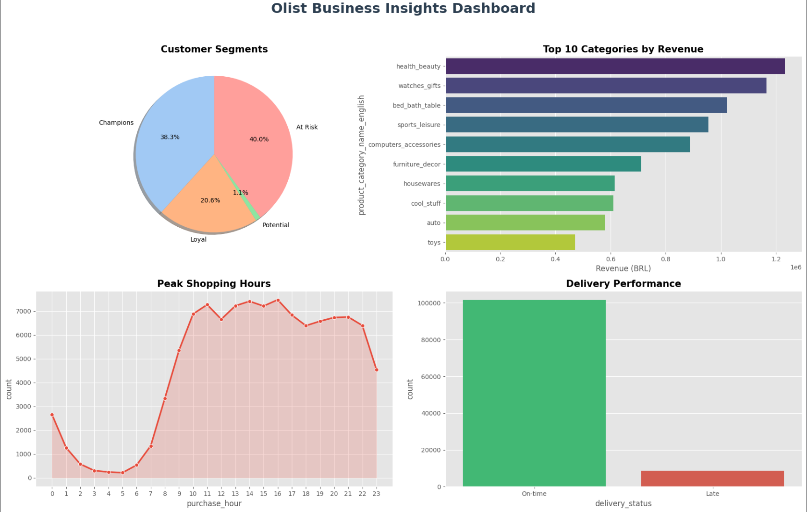

# Olist E-Commerce Data Analysis
Predicting business performance and segmenting customers using the Olist dataset. Features big data processing with **PySpark**, RFM Analysis, and Logistics Performance tracking.

---

## Project Overview
The goal of this project is to transform raw transactional data from **Olist** (the largest department store marketplace in Brazil) into actionable business insights. By leveraging **Big Data** techniques, we identify high-value customer segments and operational bottlenecks to optimize e-commerce strategies.

## Data Source & Big Data Handling
The dataset consists of 100k+ orders from 2016 to 2018, distributed across 9 interrelated tables.
* **Original Source:** [Olist Dataset on Kaggle](https://www.kaggle.com/datasets/olistbr/brazilian-ecommerce)
* **Big Data Optimization:** Used **PySpark (Spark SQL & DataFrames)** to handle large-scale joins and aggregations that would typically overwhelm standard Pandas memory limits.
* **Efficiency:** Implemented `.cache()` and `.persist()` strategies to optimize iterative analytical queries.

## Technical Stack
* **Language:** Python
* **Big Data Framework:** Apache Spark (PySpark).
* **Libraries:** `Pandas`, `Matplotlib`, `Seaborn`.
* **Tools:** Google Colab, GitHub Data Pipeline.

## Key Features & Workflow
### 1. Advanced ETL & Data Cleaning
* Joined 9 relational tables (Orders, Items, Customers, Products, etc.) using PySpark.
* Handled Portuguese-to-English category translations for global business accessibility.
* Processed complex timestamps to calculate delivery lead times.

### 2. Feature Engineering
* **Logistics Tracking:** Calculated `delivery_days` and `estimated_diff` to identify late shipments.
* **Time-series Extraction:** Derived purchase hours and weekdays to find peak shopping windows.

### 3. Customer Segmentation (RFM Model)
* **Recency:** Days since the last purchase.
* **Frequency:** Total number of unique orders per customer.
* **Monetary:** Total revenue generated by each customer.
* **Scoring:** Used Spark **Window Functions** (`ntile`) to rank customers from 1-5.

## Project Dashboard
We visualize the core business metrics and customer segments to drive decision-making.

<p align="center">
  
</p>
<p align="center">
  <em>(Olist Business Insights Dashboard: RFM Distribution, Top Categories, and Delivery Performance.)</em>
</p>

## Repository Structure
* `data/`: Relational CSV files from the Olist ecosystem.
* `dashboard/`: Visualization charts and the final Business Dashboard.
* `notebooks/`: Comprehensive PySpark Notebook with step-by-step ETL and Analysis.
* `README.md`: Project documentation and business summary.
* `requirements.txt`: List of required Python libraries.

## Results & Business Insights

### Actionable Intelligence:
* **Customer Loyalty:** Identified that the majority of the base are **Potential Loyalists**, requiring targeted CRM campaigns to convert them into **Champions**.
* **Operational Excellence:** Identified peak ordering hours between **10:00 AM - 02:00 PM**, suggesting the optimal window for promotional push notifications.
* **Product Strategy:** The *Health & Beauty* and *Housewares* categories are the primary revenue drivers, justifying increased inventory focus.
* **Logistics Health:** While most orders are "On-time", the "Late" segment shows correlation with specific geographic regions, suggesting a need for carrier re-evaluation.

## How to Run
1. Clone the repository:
   ```bash
   git clone [https://github.com/PhcPh4m/Olist-Ecommerce-Data-Analysis.git](https://github.com/PhcPh4m/Olist-Ecommerce-Data-Analysis.git)
2. Upload the notebook to Google Colab.
3. Ensure the data/ folder contains the necessary CSV files or pull them directly from the repository.
4. Run all cells to see the Spark execution and the final Dashboard.
